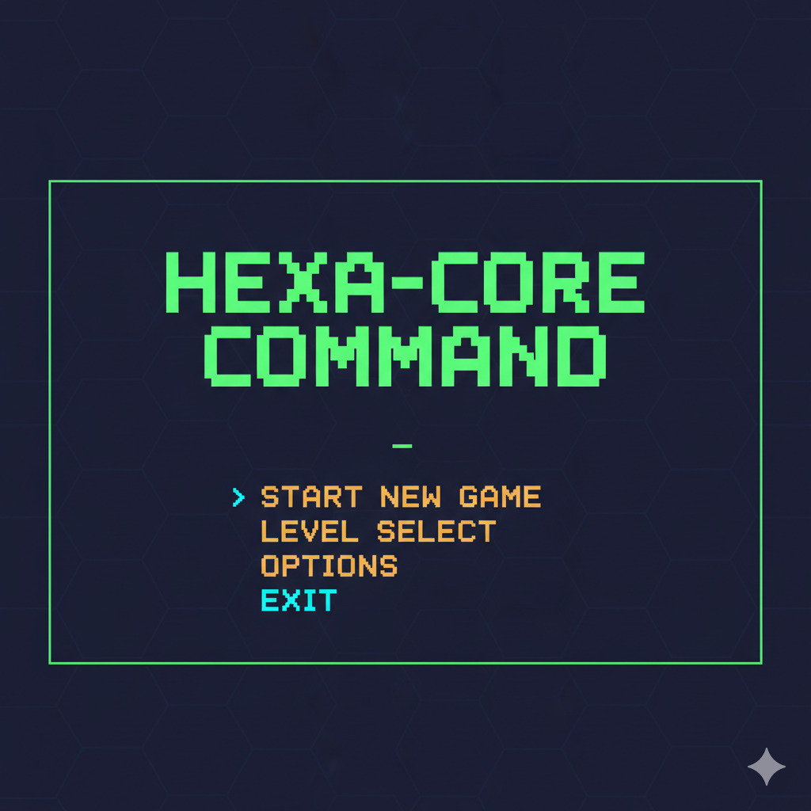
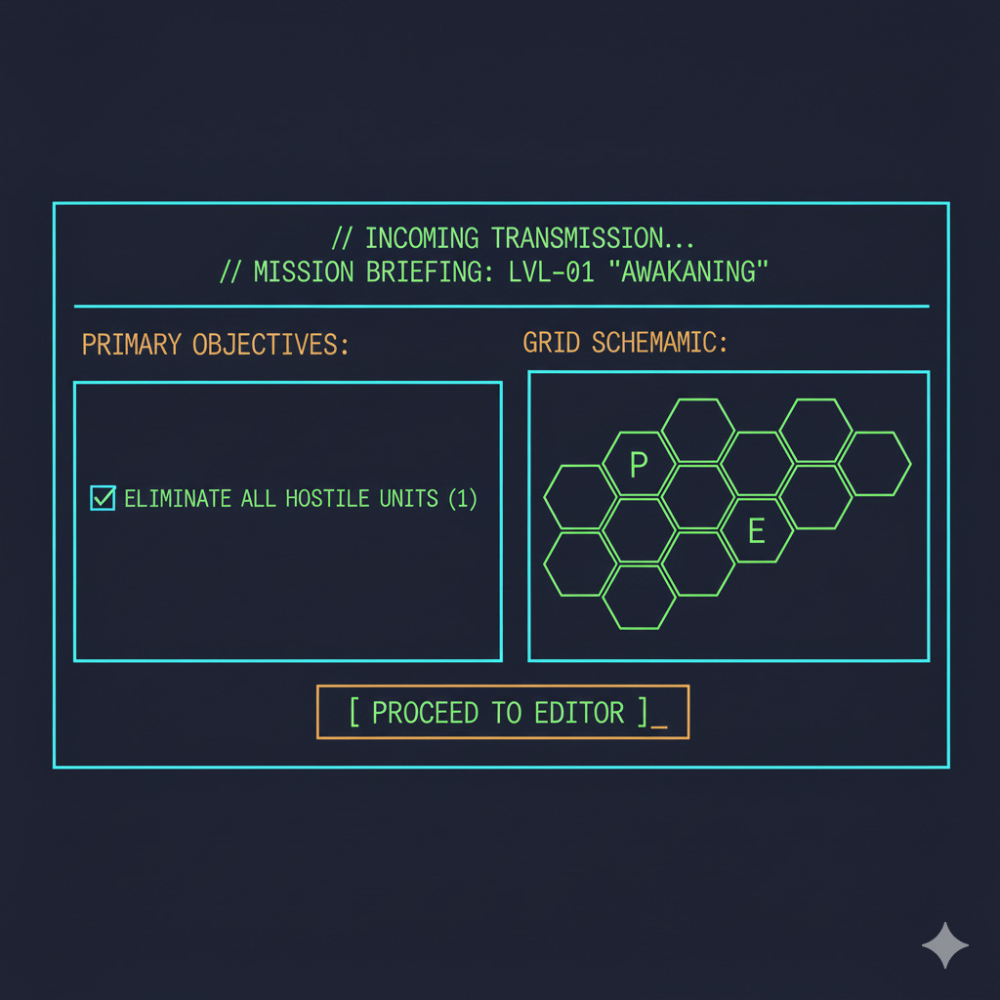
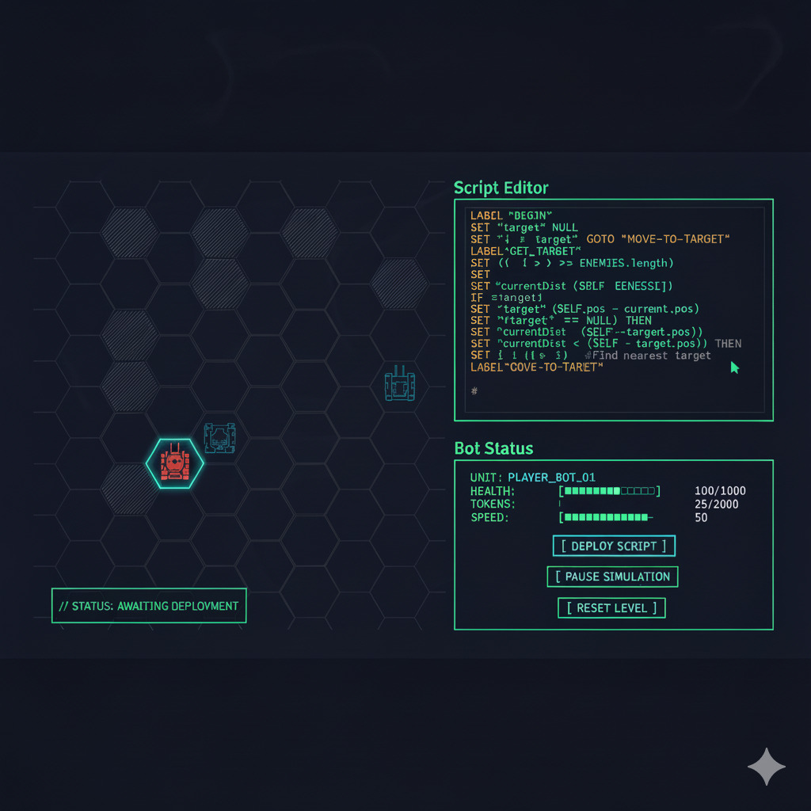

# Initiative 0002: MVP User Interface Implementation

* **Objective:** Implement the core user interface screens for the MVP based on the provided design mock-ups.
* **Status:** In Progress
* **Artifacts:** Temporary planning materials. Store associated images under
  `docs/initiatives/artifacts/0002-mvp-ui-implementation/`. Archive them after
  implementation and update the living documentation (e.g., a new
  `docs/renderer.md`).

## 1. UI Screens

### 1.1 Main Menu

**Mock-up:**

**Requirements:**

* Implement a static main menu screen.
* Options: "Start New Game", "Level Select", "Options", "Exit".
* For the MVP, only "Start New Game" (leading to the Mission Briefing) and "Exit" need to be functional.

### 1.2 Mission Briefing

**Mock-up:**

**Requirements:**

* Display mission information loaded from a map file (e.g., `assets/maps/level_01.json`).
* Show primary objectives.
* Display a simplified grid schematic.
* The "Proceed to Editor" button should transition to the Gameplay UI.

### 1.3 Gameplay UI

**Mock-up:**

**Requirements:**

* **Grid View:** Render the hexagonal game grid.
* **Script Editor:** A text area for viewing/editing Hexa-Script.
* **Bot Status:** Display key stats for the player's bot.
* **Controls:** Implement buttons for "Deploy Script", "Pause Simulation", and "Reset Level".

---

## 2. Implementation Roadmap

* [x] **Task 1:** Implement the `HexaRenderer` to display the Main Menu screen.
* [x] **Task 2:** Implement the state transition to the Mission Briefing screen.
* [ ] **Task 3:** Implement data loading and display for the Mission Briefing screen.
* [ ] **Task 4:** Implement the state transition to the Gameplay UI screen.
* [ ] **Task 5:** Implement the basic layout of the Gameplay UI (Grid, Editor, Status panels).
* [x] **Task 6:** Create `docs/renderer.md` as the living documentation for the UI and archive this initiative.

## 3. Final Confirmation
After creating the files, confirm that the plan has been executed successfully.
